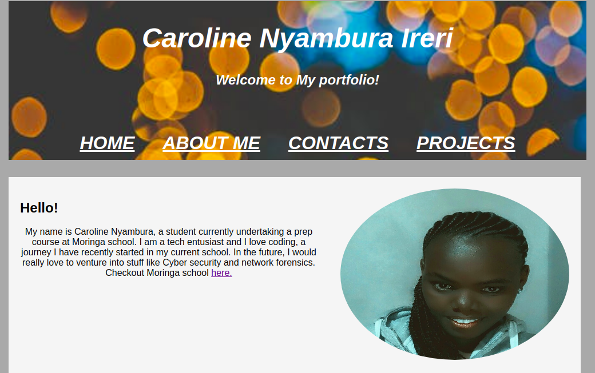
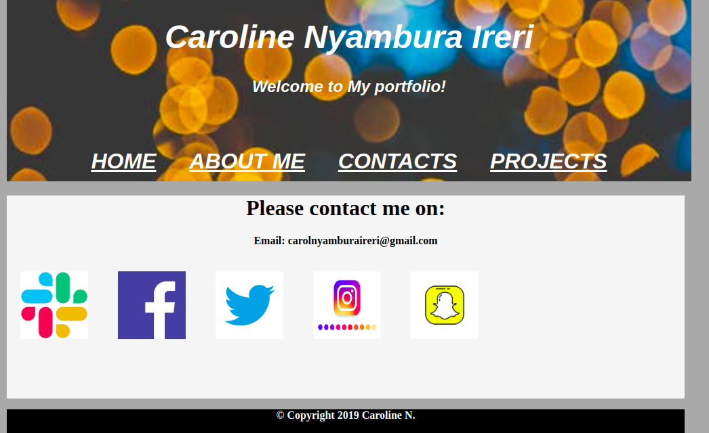

# PORTFOLIO WEBSITE

## Project Author

Caroline Nyambura Ireri

## Screenshots

## Description

This is a portfolio website that gives information about my education background,skills,interests and some of the projects that I have worked on.

## Deploying

To view this project, please use this live link. https://carolineireri.github.io/portfolio/

## BDD

On visiting this webpage, The home page is displayed which contains my name and a breif introduction. There is a navigation tab at the top of the page which links you to the respective content upon clicking on the corresponding tab. If you click on Contacts for example, the content with my contacts is displayed.

## Technologies used

-HTML
-CSS

## Known Bugs

The social media icons are not functional at the moment.

## Contributing changes

To contribute to changes in this project, feel free to fork this project on github and clone it to your local repository. Use this link https://github.com/carolineireri/portfolio

## Support and Contact details

For any questions,feedback or comment please contact me via email: carolnyamburaireri@gmail.com

## Licence

This project is licensed under the MIT License. PLease check LICENSE.md file for more information.
